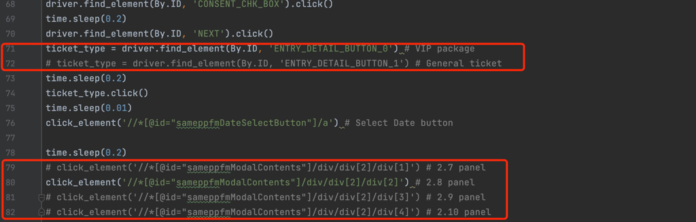
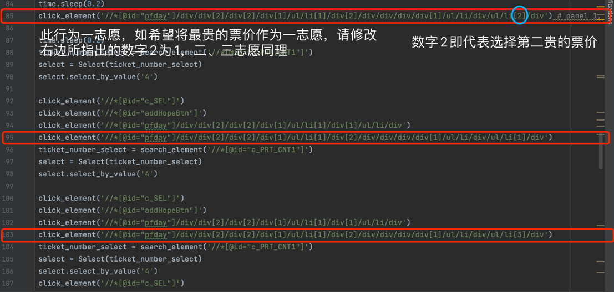

# 系统要求
- 安装Chrome浏览器
- 安装Chrome浏览器对应版本的Chrome（下载地址：https://chromedriver.chromium.org/downloads，安装教程：https://zhuanlan.zhihu.com/p/373688337）
- python3.8以上
- 安装有selenium包（安装教程：https://zhuanlan.zhihu.com/p/373688337）

# 使用方法
- 修改info.txt的内容，隔行填写注册信息、扣款信息并保存。（程序跨行读取，所以请不要修改文件结构骨架，不要自己另起行）
- 选择日期和票类型，将不选择的日期注释掉。如图红框：
- 选择志愿顺序，如图：
- 运行bot.py

# 注意事项
- 重要！！在拖动验证码时，程序会暂停，请拖动验证码但不要点击"NEXT"按钮，请点击本程序弹出的窗口的"OK"键。其余情况下请勿操作浏览器窗口。
- 如提示该场次注册申请以达到最大值，请更换日期
- 全程将鼠标移至浏览器窗口之外
- 当您的银行卡收到两次扣款，每次扣款1日元，并且邮箱收到注册确认信息时，即代表本程序运行完成，注册成功。您可继续注册下一场或购买另一种类的票。
- 免责声明：本程序不会记录您的任何信息，且不会上传至任何地方，不放心的可以查看源码。作者不对此程序的合法性及最后门票的可用性负责。