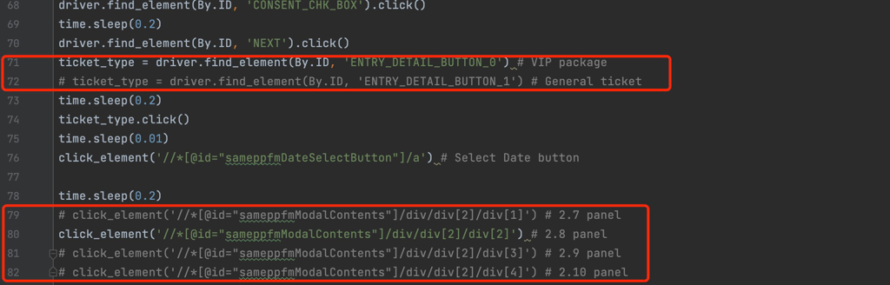
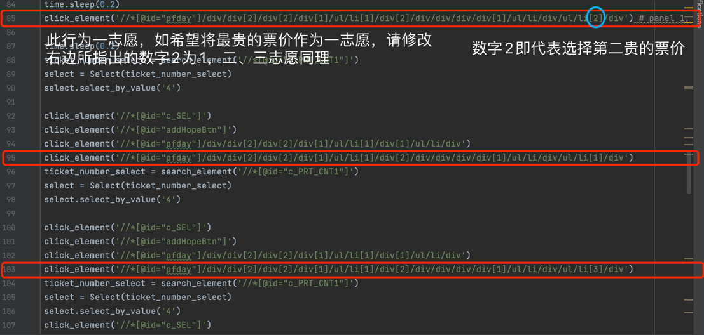

# 系统要求 / System Requirements
- 已安装Chrome浏览器 / Chrome browser installed
- 安装与Chrome浏览器版本相对应的ChromeDriver（下载地址 / Download link: https://chromedriver.chromium.org/downloads，安装教程 / Installation guide: https://zhuanlan.zhihu.com/p/373688337）
- Python 3.8或更高版本 / Python 3.8 or higher
- 已安装selenium包 / Selenium package installed (安装教程 / Installation guide: https://zhuanlan.zhihu.com/p/373688337)

# 使用方法 / Usage
- 编辑`info.txt`文件，交替填写注册信息和扣款信息，然后保存。请确保不要更改文件的结构或自行添加新的行。 / Edit the `info.txt` file, alternating between registration information and payment information, then save. Ensure not to change the file structure or add new lines on your own.
- 选择日期和票务类型，对不选择的日期进行注释。示例如下图红框所示： / Select the date and ticket type, comment out the dates you do not choose. Example shown in the red box in the image: 
- 选择志愿顺序，示例图如下： / Choose the order of preferences, example shown in the image: 
- 运行`bot.py` / Run `bot.py`

# 注意事项 / Important Notes
- 非常重要！当拖动验证码时，程序将暂停。请拖动验证码但不要点击“NEXT”按钮，而应点击本程序弹出的窗口中的“OK”按钮。在其他情况下，请避免操作浏览器窗口。 / Very important! When dragging the captcha, the program will pause. Please drag the captcha but do not click the "NEXT" button, instead, click the "OK" button on the popup window from this program. In other cases, avoid operating the browser window.
- 如果提示该场次注册已达最大人数，请尝试更换日期。 / If notified that the registration for the session has reached its maximum capacity, please try changing the date.
- 在整个过程中，请将鼠标指针保持在浏览器窗口之外。 / Keep the mouse pointer outside the browser window throughout the process.
- 当您的银行账户被扣款两次，每次1日元，并收到注册确认邮件时，表示程序已成功完成注册。您可以继续注册其他场次或购买不同类型的票。 / When your bank account is charged twice, each 1 Japanese Yen, and you receive a registration confirmation email, it indicates the program has successfully completed the registration. You can proceed to register for another session or purchase a different type of ticket.
- 免责声明：本程序不会记录或上传您的任何信息。若有疑虑，可查阅源代码。作者不对程序的合法性或最终门票的有效性负责。 / Disclaimer: This program does not record or upload any of your information. If concerned, you are welcome to review the source code. The author is not responsible for the legality of the program or the validity of the final tickets.
